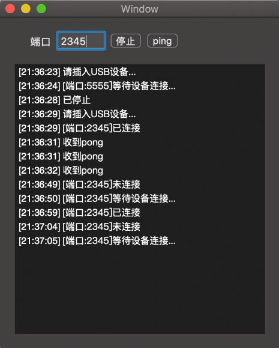

该项目基于peertalk封装

https://github.com/rsms/peertalk

使用Pod的话，你需要在Podfile文件里添加以下行：

``````
pod 'PeerTalk', :git => 'https://github.com/rsms/peertalk.git', :commit => '588303b43efa5082d654b6f75d1b84a6ba4b5b9e'
``````

提供两个类：SimpleUSBHubClient、SimpleUSBHubServer

通常将Server部署到移动设备，Client部署到Mac OS

在服务端：

``````
SimpleUSBHubServer* server = [[SimpleUSBHubServer alloc] initWithPort:2345];
[server startWithStateCallback:^(SimpleUSBHubState state) {
	NSLog(@"%d", state);
} receiveCallback:^(uint32_t type, PTData *payload) {
    NSLog(@"receive: %d", type);
    if (type == 102)
    {
    	NSLog(@"收到ping");
    	// 答复，回复pong
    	[self->_server sendFrameOfType:103 withPalload:nil];
    }
}];
_server = server;
``````

在客户端：

``````
SimpleUSBHubClient* client = [[SimpleUSBHubClient alloc] initWithPort:2345];
client.connectInterval = 1.0f;
[client startWithStateCallback:^(SimpleUSBHubState state) {
	NSLog(@"%d", state);
} receiveCallback:^(uint32_t type, PTData *payload) {
    NSLog(@"receive: %d", type);
    if (type == 103)
    {
    	NSLog(@"收到pong");
    }
}];
_client = client;
// 测试，发送ping消息
[self->_client sendFrameOfType:102 withPalload:nil];
``````

你可能需要了解NSData -> dispatch_data_t的使用，来传输数据

效果图：

